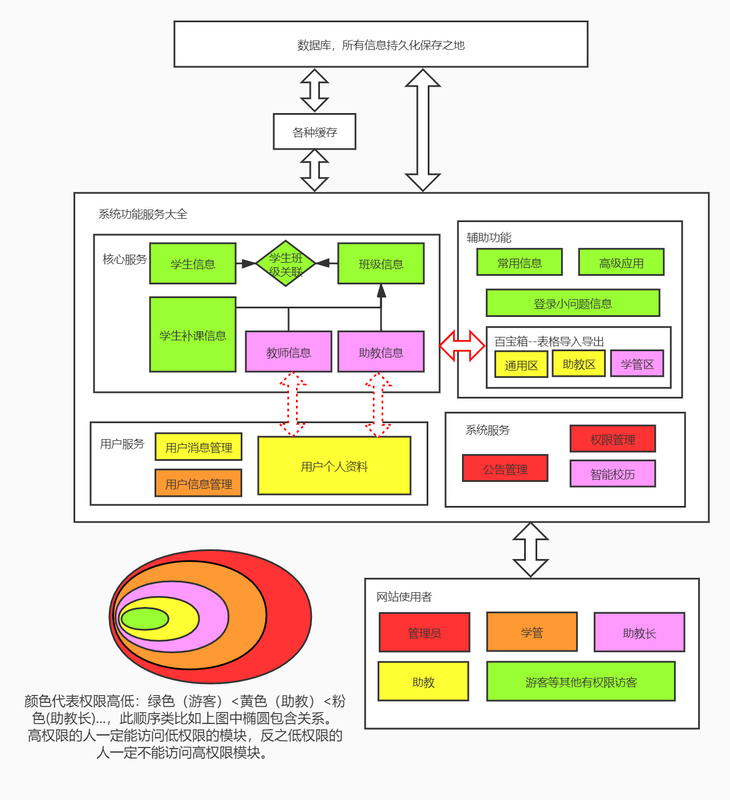
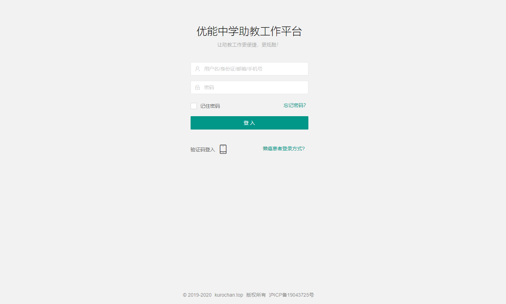
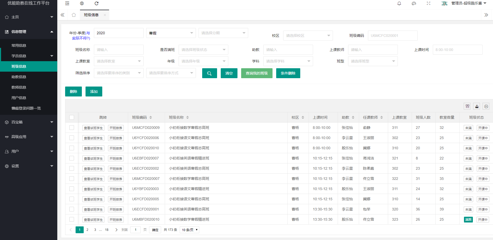
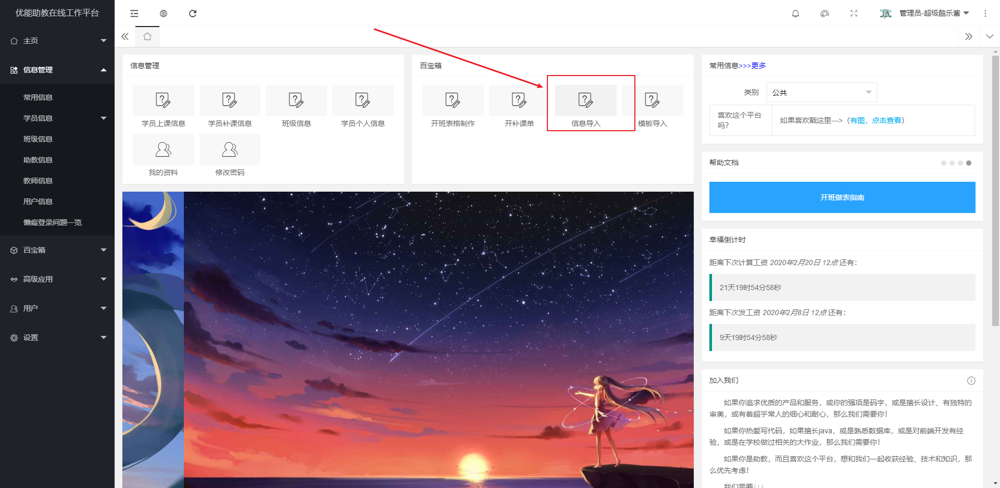
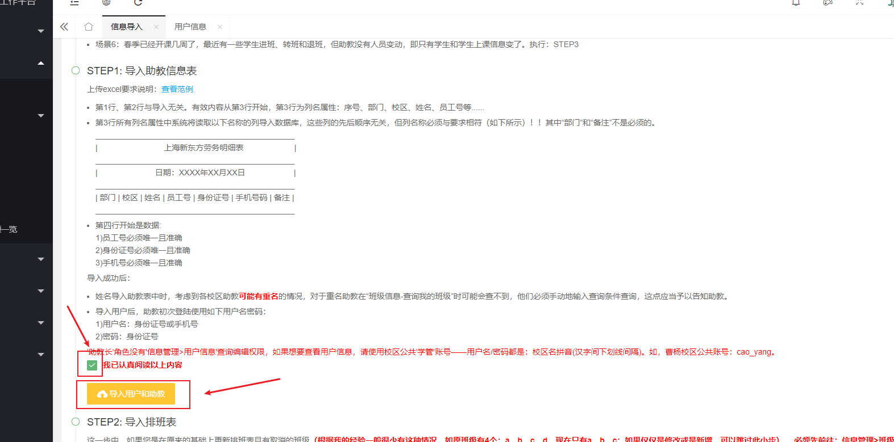
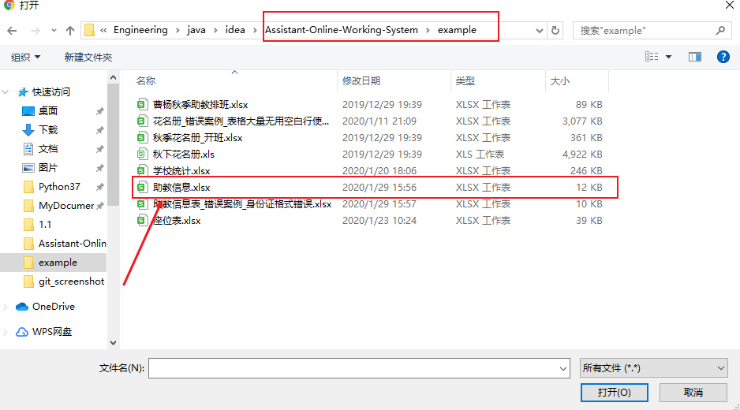
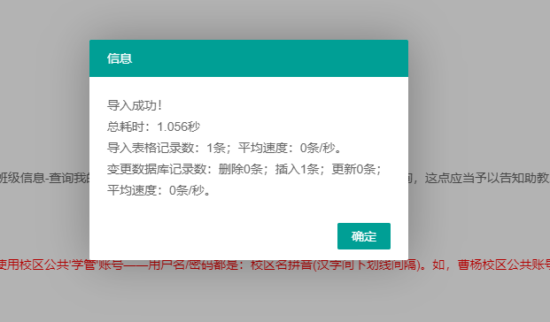
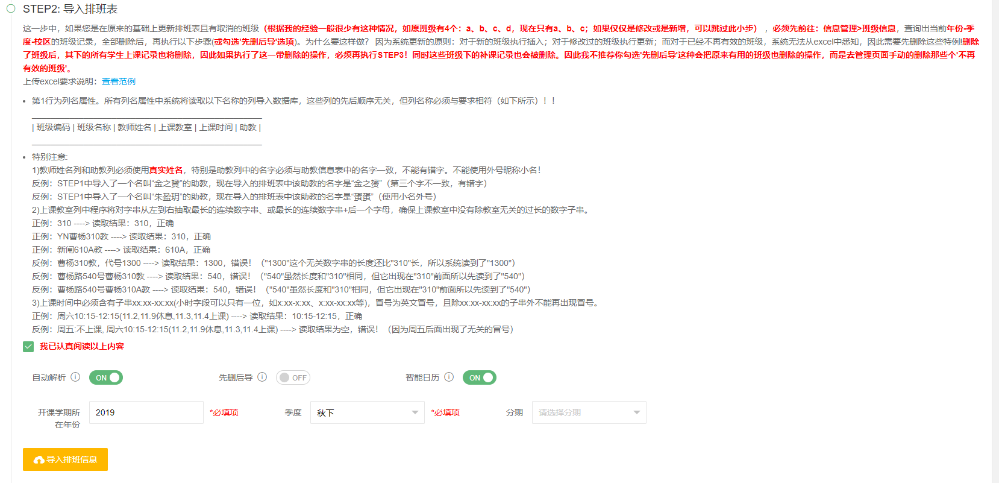
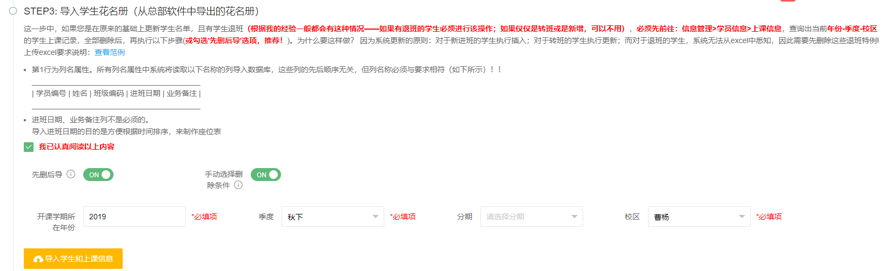

# Assistant-Online-Working-System

——写在最前面

​	**作为学生党，非科班的我经历了大三到大四接近一年半艰辛的java自学路线，走了不少弯路，也有许多失败的面试经历。对于程序员这条路的艰辛，我也深有体会。本着开源的理念、让更多初学者少走弯路的初心，在此我将项目源码开源，供大家学习，也可以让更多想我这样的“非科班”积累项目经验（这也是相比科班最吃亏的一项）。	 **

​	**当然，欢迎相收获知识、收获经验的同学加入和我一起经营这个小破站！先声明，本网站项目是本人自愿发起，没有任何经费不具有盈利性，服务器等费用全部由我本人开销（对于这个阶段的我来说，对知识和经验的需求胜过一切金钱）。招募信息见文末[Contant me](#contact_me)。**

​	**最重要一点，虽然在我提供的数据中已经删除了原来身份证等（只留我自己的供演示）一些敏感信息，但是许多手机号都还是保留了。本着对大家的信任，希望广大学习者不要“利用”这些信息。**

## Brief Introduction

*优能中学助教工作平台是一个大学生为新东方助教团队自主研发的第三方平台。其提供学生信息管理、班级上课信息管理、快捷开单、快捷做表等一站式服务，在2019秋季学期初次上线后获得一致好评。*

这一项目也是站在了本人之前一些“稚嫩”的项目肩膀上（如：<https://github.com/KuroChan1998/Student-Information-Administration-System>）[😂](https://apps.timwhitlock.info/emoji/tables/unicode#emoji-modal)。如果是从这个repository来的小伙伴推荐再看看这个项目，因为那个项目很多地方都太不“专业”太不规范了。

* 本项目的编码规范基于阿里P3C标准：<https://github.com/alibaba/p3c/blob/master/%E9%98%BF%E9%87%8C%E5%B7%B4%E5%B7%B4Java%E5%BC%80%E5%8F%91%E6%89%8B%E5%86%8C%EF%BC%88%E5%8D%8E%E5%B1%B1%E7%89%88%EF%BC%89.pdf>

*我将概念性地为您展示本系统的设计理念和整体蓝图，便于您更优雅地学习和开发本系统。*

以下引用是本人在网站“特别鸣谢”区中的感想原话：

> ​    首先，作为曹杨校区的一名助教，我对助教工作的辛苦深有体会（特别是开班阶段做表，不难但特烦）。我也一直在寻找减轻大家工作负担的方式，尽到我最微薄之力。
>
> ​    一开始的想法还是源于室友（非计算机相关专业） 说实习时嫌做excel麻烦，他自己用python写了个处理表格的脚本。 我就说我助教也要做表，尤其是座位表特别费时，得一个个序号对着填，名单一变整个班的表就得重做，能不能也搞个程序处理一下? 讨论一下，理论可行，那就干呗！于是经过几周的努力，就有了第一版客户端的[助教百宝箱](http://blog.kurochan.top/2019/11/02/%E6%96%B0%E4%B8%9C%E6%96%B9-%E5%8A%A9%E6%95%99%E7%99%BE%E5%AE%9D%E7%AE%B1%E4%BD%BF%E7%94%A8%E6%8C%87%E5%8D%97/) 。 后来由于开补课单的需求急切，且客户端的兼容性较差。所以想着干都干了，不如干一票大的！做个服务齐全且高度集成的网站，界面也会更好看，大家使用起来也方便......
>
> ​    在这里非常感谢两位学管提供的数据和对需求分析做出的贡献，也感谢所有对这个项目给予过各种支持的人！你们的肯定，就是我前进的动力，是让我继续开发出令你们“卧槽”的功能的动力！

正如上文所言，我设计本系统的初心是为了便利助教做表、信息查询等。为追求最大程度的”便利“，我寻找了各种方案来尽可能“合理”、“高效”且“优雅”地减少绝大多数用户的工作量。

最终我的想法是：想要助教的工作量小一点，学管们的工作量就应该大一些；想要学管的工作量小一点，系统管理员们的工作量就应该大一些；想要系统管理员的工作量小一点，底层程序代码的工作量就应该大一些。

- 底层——源程序作为系统根基，是一切“魔法”（以助教自动做表为代表的功能十分惊艳，因此我更倾向于称部分功能为“魔法”）的关键，也是大家的“工具人”，无情的“执行”机器。
- 系统管理员作为最高权限管理者负责的权限管理、公告管理等系统的高级设置工作。
- 学管和助教长作为“过渡”的一层，起着至关重要的作用。他们负责将各种信息的定期更新导入，直接与系统数据“打交道”。
- 助教：金字塔的最顶层，是最大的用户群体，与系统交互最为频繁，应该享有**小而合理的权限以及最小的工作量**。

系统的各功能模块概念图如下：



## Technologies Used

### 前端

- 前端框架 : `layui`
- 数据可视化技术 : `echarts`

### 后端

- MVC&IOC框架 : `SpringBoot`
- ORM框架 : `Mybatis`
- 安全框架：`shiro`
- 缓存技术：`Redis`
- 数据库：`Mysql`
- 日志 : `Log4j2`

## Project Structure

```
├─aows_resources       //网站用户上传的各种文件
├─database             // 数据库相关文件
│  ├─design	                // 数据库设计
│  └─sql                    // 数据库初始化脚本文件
├─example               //一些用来导入数据库的数据的表格excel示例
├─git_screenshot        // 存放README.md 中的图片
├─src                   // 项目源代码目录
│  ├─main
│  │  ├─java
│  │  │  └─com
│  │  │      └─jzy
│  │  │          ├─config             //springboot配置类
│  │  │          ├─dao                //持久层，与数据库交互
│  │  │          ├─manager            //一些公共的api
│  │  │          │  ├─aspect          //springAop切面
│  │  │          │  ├─constant        //所有常量类
│  │  │          │  ├─exception       //所有异常
│  │  │          │  └─util            //所有工具类
│  │  │          ├─model              //所有模型类
│  │  │          ├─service            // 服务层
│  │  │          │  └─impl            // 服务层接口实现
│  │  │          └─web                //web层
│  │  │              ├─controller     //所有springmvc控制器
│  │  │              ├─interceptor    //所有springmvc拦截器
│  │  │              └─shiro          //shiro的realm实现
│  │  └─resources                     // 资源文件目录
│  │      ├─com
│  │      │  └─jzy
│  │      │      └─mapper             // mybatis对dao接口的xml实现
│  │      ├─myConfig                  // 存放自己的一些配置，如自定义的属性文件等
│  │      ├─static                    // springboot默认静态资源目录
│  │      │  ├─custom                 // 自定义的静态资源
│  │      │  └─plugins                // 引用的第三方的静态资源，如layui前端框架...
│  │      └─templates
│  └─test                           // 测试代码目录
├─README.md                         // help
├─ISSUES.md                         // 问题大全
└─pom.xml                           // maven依赖
```

## Quick Start

### 1 : 项目开发环境

- IDE : `IntelliJ IDEA 2018.1.7`
- 项目构建工具 : `Maven 3.5.4`
- 数据库 : `Mysql 8.0.13`
- Redis：`Redis server 3.2.100`
- JDK版本 : `jdk 1.8`

### 2 : 项目的初始构建

1. *在你的Mysql中，运行我提供的database/sql/init.sql 文件（注意mysql版本与sql脚本中部分代码的兼容性，使用mysql5可能会出现字符集不存在的问题）, 成功会创建名为aows的数据库，以及一系列数据表。*

2. *使用 IntelliJ IDEA 导入项目，选择Maven项目选项，一路点击next，即可将项目所需依赖导入（若依赖下载速度较慢，请参考百度更改国内镜像）。*

   

   

3. *进入src/main/resources修改application.properties配置文件*

   - 修改mysql连接信息

     ```properties
     #JDBC
     #你的mysql连接url，localhost(本机)，端口：3306（默认），数据库：aows（上一步完成创建）
     spring.datasource.url=jdbc:mysql://localhost:3306/aows?useUnicode=true&characterEncoding=utf8&serverTimezone=GMT%2B8&useSSL=false
     #你的mysql用户名
     spring.datasource.username=root
     #你的mysql密码
     spring.datasource.password=123
     ```

   - 修改redis连接信息

     ```properties
     #redis
     #你的redis主机地址
     spring.redis.host = localhost
     #你的redis端口
     spring.redis.port = 6379
     #你的redis密码
     spring.redis.password = 123
     ```

   - 如果有必要可以修改当前项目部署端口和部署路径（可选）

     ```properties
     #端口
     server.port= 80
     #项目部署路径
     server.context-path= /
     ```

4. *进入src/main/resources查看log4j2.xml，如果有必要可以修改日志输出路径rootPath，目前在D://warlogs//logs-aows下，你可选择不修改跳过此步。*

   ```xml
   <configuration status="WARN" monitorInterval="1800">
       <Properties>
           <property name="rootPath">D://warlogs//logs-aows</property>
           <!--<property name="rootPath">/root/warlogs/logs-aows</property>-->
           ...
       </Properties>
       ...
   </configuration>
   ```

5. *进入src/main/resources/myConfig查看filePath.properties。其中project.root.path为用户上传的头像等文件的保存路径。注意，在你clone下来的项目的根目录中有一个叫aows_resources的文件夹，将它复制到D盘下即可。**这里project.root.path=D:\\\\aows_resources\\\\指的是D:\\下有一个叫aows_resources的文件夹。如果你将project.root.path改成C:\\\myFile\\\\aows_resources\\\\，你就应该将aows_resources文件夹复制到C:\\myFile\\目录下。***

   ```properties
   # windows下，开发环境使用
   project.root.path=D:\\aows_resources\\
   # ubuntu下，生产环境使用
   #project.root.path= /root/aows_resources
   
   ...
   ```

6. *运行com.jzy.App，在浏览器中输入localhost，进入用户登录页面。使用用户名/密码：kurochan/kurochan，完成登录。*

   

## Detailed Functions

使用kurochan账号登录进入主页后。你可以在“左侧菜单栏—信息管理”中查到一些信息，这些信息是通过前面的init.sql脚本导入数据库的。



当然在实际的业务情景中，数据都是通过excel导入的。**这里我在项目根目录下example文件夹下给出了一些用来导入数据的excel示例，下面通过example中的示例表来示范如何完成一次实际开课情景中的信息导入。**

点击主页控制台中的快捷方式“信息导入”进入导入页面。



* 以STEP1为例，选择example目录中的“助教信息.xlsx”导入，导入成功后会有相应提示。example目录中也有一些错误示例，你可以自行调试，后再阅读项目源码学习如何通过poi处理excel并进一步导入数据库。

  

  

  

* STEP2中按下图填写勾选表单，然后同STEP1一样导入example中的"曹杨秋季助教排班.xlsx"。

  

* STEP3中按下图填写勾选表单，然后导入example中的"秋下花名册.xls"。

  

* STEP4导入example中的"秋季花名册_开班.xlsx"。
* STEP4.5导入example中的"学校统计.xlsx"。

之后在信息管理上课信息、班级信息等中即可看到刚才导入的“2019年秋下学期”的信息。

*更多功能使用参见：*<http://blog.kurochan.top/2020/01/01/%E4%BC%98%E8%83%BD%E5%8A%A9%E6%95%99%E5%9C%A8%E7%BA%BF%E5%B7%A5%E4%BD%9C%E5%B9%B3%E5%8F%B0%E4%BD%BF%E7%94%A8%E6%8C%87%E5%8D%97/>

## <span id='contact_me'>Contact me</span>

- qq: 929703621
- wechat: Jzy_bb_1998
- e-mail: 929703621@qq.com

* 团队招募，有意者戳：929703621@qq.com。不限经验，只要有一颗热爱学习的心。
  * 前端：layui、freemarker、js、jquery
  * 后端：springboot、mybatis、mysql、redis
  * 码字文手：用户使用文档撰写

